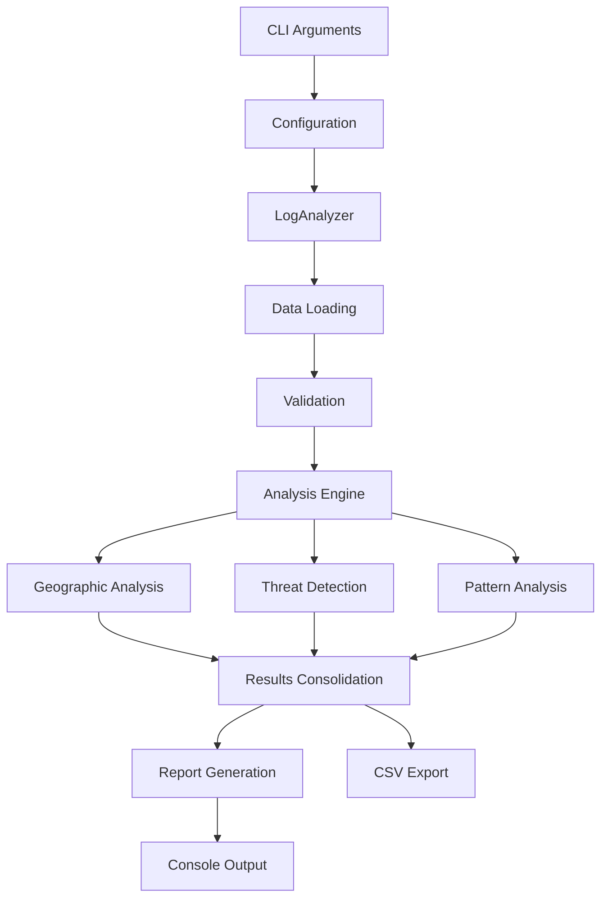

# Arquitetura do Log Analyzer

## Visão Geral

O Log Analyzer foi refatorado para seguir princípios de arquitetura limpa e boas práticas de desenvolvimento Python.

## Estrutura Modular

### 1. Camada de Entrada (`main.py`, `run_analyzer.py`)
- **Responsabilidade**: Interface CLI, parsing de argumentos, orquestração
- **Princípio**: Single Responsibility - cada script tem uma função específica
- **Padrão**: Command Pattern para processamento de argumentos

### 2. Camada de Negócio (`src/log_analyzer/`)

#### `core.py` - Classe Principal
```python
class LogAnalyzer:
    """Orquestrador principal das análises"""
    - load_log_file()      # Carregamento e validação
    - analyze_*_logs()     # Análises específicas por tipo
    - detect_*()           # Algoritmos de detecção
    - generate_summary()   # Consolidação de resultados
```

#### `geographic.py` - Análise Geográfica
```python
class GeographicAnalyzer:
    """Especialista em análise geográfica"""
    - get_ip_location()           # API de geolocalização
    - analyze_geographic_patterns() # Detecção de anomalias geo
    - _is_private_ip()            # Validação de IPs
```

#### `utils.py` - Utilitários
- Funções puras e helpers
- Validação de dados
- Formatação e conversões
- I/O de arquivos

#### `config.py` - Configurações
- Configurações centralizadas
- Esquemas de validação
- Constantes do sistema

### 3. Camada de Dados
- **Entrada**: CSV, JSON (pandas DataFrame)
- **Cache**: Geolocalização de IPs 
- **Saída**: CSV estruturado, console formatado

## Princípios Aplicados

### 1. **Separation of Concerns**
- Análise geográfica isolada em módulo próprio
- Utilitários separados da lógica de negócio
- Configurações centralizadas

### 2. **Dependency Injection**
- Configurações injetadas nas classes
- Console Rich injetado para flexibilidade
- Cache compartilhado entre componentes

### 3. **Open/Closed Principle**
- Facilmente extensível com novos tipos de análise
- Novos formatos de entrada podem ser adicionados
- Algoritmos de detecção podem ser substituídos

### 4. **Single Responsibility**
- Cada classe tem uma responsabilidade específica
- Funções pequenas e focadas
- Módulos coesos

## Fluxo de Dados



## Padrões de Design Utilizados

### 1. **Strategy Pattern**
- Diferentes algoritmos de detecção
- Múltiplos formatos de entrada
- Vários tipos de análise

### 2. **Template Method**
- Fluxo padrão de análise
- Hooks para extensibilidade
- Validação padronizada

### 3. **Factory Pattern** (implícito)
- Criação de DataFrames baseada no tipo
- Instanciação de analisadores
- Formatação de saída

### 4. **Observer Pattern** (futuro)
- Sistema de eventos para análises
- Notificações de progresso
- Alertas em tempo real

## Estrutura de Diretórios

```
log-analyzer/
├── src/log_analyzer/      # Código principal
├── tests/                 # Testes unitários
├── docs/                  # Documentação técnica
├── config/                # Configurações
├── samples/               # Dados de teste
├── exports/               # Saída de relatórios
└── scripts/               # Scripts auxiliares
```

## Vantagens da Arquitetura

### 1. **Manutenibilidade**
- Código organizado em módulos coesos
- Fácil localização de funcionalidades
- Dependências claras e explícitas

### 2. **Testabilidade**
- Classes com responsabilidades únicas
- Injeção de dependências facilita mocks
- Funções puras sem efeitos colaterais

### 3. **Extensibilidade**
- Novas análises podem ser adicionadas facilmente
- Suporte a novos formatos sem modificar core
- Plugin system pode ser implementado

### 4. **Performance**
- Cache inteligente para operações custosas
- Lazy loading de dados geográficos
- Processamento otimizado de DataFrames

### 5. **Configurabilidade**
- Configurações externalizadas
- Múltiplos níveis de configuração
- Override via linha de comando

## Próximos Passos

### 1. **Testes Automatizados**
- Testes unitários para cada módulo
- Testes de integração
- Coverage reports

### 2. **Sistema de Plugins**
- Interface para análises customizadas
- Carregamento dinâmico de módulos
- Registry de plugins

### 3. **API REST**
- Endpoint para análises remotas
- Autenticação e autorização
- Rate limiting

### 4. **Real-time Processing**
- Stream processing de logs
- Alertas em tempo real
- Dashboard web

## Conclusão

A nova arquitetura mantém compatibilidade com o sistema anterior enquanto introduz estrutura modular, extensível e testável. O design permite evolução incremental e facilita manutenção a longo prazo.